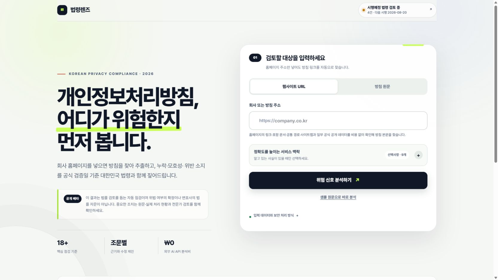
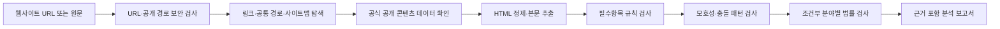

# 법령렌즈

대한민국 개인정보 보호법에 기반해 개인정보처리방침의 누락·모호성·조건부 위험을 탐지하는 무료 컴플라이언스 지원 웹앱입니다.

[](https://github.com/GGBoo0/law-lens-privacy-auditor/actions/workflows/ci.yml)
[](./LICENSE)
[](./lib/legal-baseline.ts)

**[라이브 데모 사용하기](https://law-lens-privacy-kr.zzboof.chatgpt.site)** · **[피드백 남기기](https://github.com/GGBoo0/law-lens-privacy-auditor/issues/new/choose)**



## 프로젝트 소개

개인정보처리방침을 AI에 넣고 곧바로 위법 여부를 판단하게 하면 결과의 재현성과 설명 가능성이 떨어질 수 있습니다. 법령렌즈는 법률 결론을 대신 내리지 않고 다음 세 가지를 분리해 보여주는 것을 목표로 합니다.

- 법정 기재사항의 **누락 가능성**
- 포괄적 표현과 문단 충돌 같은 **불명확·보완 후보**
- 실제 서비스 동작을 확인해야 하는 **현장 검증 필요사항**

모든 지적에는 원문 근거, 관련 법령·조문, 수정 권고와 자동 판정의 신뢰도를 함께 표시합니다.

## 주요 기능

- 모바일·태블릿·데스크톱에 맞춘 반응형 분석 대시보드와 자체 호스팅 Pretendard 가변 서체
- 회사 홈페이지 또는 처리방침 URL에서 링크·포함 문서·공통 경로·사이트맵 탐색
- 공식 출처 레지스트리와 현대차·기아·카카오뱅크·TMAP·Wavve·TVING·SOOP 등의 공개 콘텐츠 데이터 지원
- 타사 채용·제휴 문서를 방침으로 오인하지 않도록 입력 회사와 후보 출처의 도메인·문맥 검증
- UTF-8·EUC-KR 문서와 대형 HTML의 제한 길이 안전 추출
- HTML 본문 정제와 개인정보처리방침 텍스트 추출
- 개인정보 보호법 제30조·시행령 제31조 중심의 필수 공개항목 검사
- 제3자 제공·처리위탁·국외 이전의 필수 정보 완전성 검사
- 포괄적인 목적·보유기간·제공 범위 등 모호한 문장 패턴 탐지
- 서로 충돌하는 제3자 제공·위탁 문구 탐지
- 위치정보·개인신용정보·전자상거래·AI 서비스 신호의 조건부 검사
- 원문 근거, 법적 근거, 수정 권고, 현장 검증 필요 여부 제공
- 제3자 제공·위탁·쿠키·국외 이전·국외 직접처리·아동·전자상거래·생성형 AI·자동화된 결정의 적용 맥락 보정
- 개인정보위 평가체계를 참고한 기재 적정성·가독성·접근성·실제 운영 일치의 분리 표시
- 원문 근거 하이라이트와 문서 SHA-256 지문
- 사람 검토 상태·메모와 검토 내용 포함 JSON
- 인쇄 대화상자를 이용한 무료 PDF 보고서 저장
- 외부 AI API·유료 브라우저·유료 데이터 API·앱 데이터베이스 없이 요청 단위 분석

## 동작 구조



### 현재 분석 방식

현재 버전은 LLM 기반 AI가 아니라 TypeScript로 작성한 규칙·정규표현식·휴리스틱 엔진을 사용합니다.

1. 제목만이 아니라 해당 섹션 안에 실질적인 설명이 있는지 검사합니다.
2. 제3자 제공·위탁·쿠키·국외 이전 등 조건부 항목은 `해당·비해당·판단 유보`를 먼저 구분합니다.
3. 국외 이전은 근거·항목·국가·시기/방법·수령인/연락처·목적/기간·거부 방법/효과를 각각 검사합니다.
4. 일반 AI와 법 제37조의2의 완전히 자동화된 결정을 분리하고, 민감정보 공개와 주민등록번호 근거도 별도 규칙으로 검사합니다.
5. “필요한 범위”, “회사가 판단하는 경우” 등 예측하기 어려운 표현과 실제 운영 입력의 충돌을 찾습니다.

화면의 숫자는 `(문구 확인 1점 + 조건부 확인 0.5점) ÷ 자동 평가대상 기재요소`로 계산하는 **자동탐지 기재 충족도**입니다. 법률 준수율·위반 확률·개인정보위 공식 평가점수가 아니며, 결과의 중심은 기재 적정성·가독성·접근성·실제 운영 일치의 네 평가축입니다.

오탐 방지를 위해 법령 요소에서 만든 긍정·부정 예제 코퍼스로 회귀 테스트합니다. 이 코퍼스는 엔진의 규칙 안정성을 확인하는 자료이며, 변호사·개인정보 전문가가 이중 검토한 통계적 정확도 데이터셋은 아닙니다.

### URL 자동 탐색 QA

2026년 8월 11일 주요 서비스 50개의 공개 홈페이지를 고정 코퍼스로 재검증한 결과, 예상한 공식 출처의 방침을 확인한 사례는 35개(70%)였고 다른 회사·채용 문서를 고른 오탐은 0개였습니다. 나머지는 `policy_not_found` 11개, 사이트 차단 2개, 상위 서버 오류 2개였습니다. 이 수치는 고정 보장값이 아니라 외부 사이트 구조와 차단 정책에 따라 달라지는 실시간 QA 결과입니다. `npm run qa:50:gate`는 공식 출처 확인 35개 이상과 오탐 0개를 공개 베타 최소 기준으로 강제합니다.

```bash
npm run test:live
npm run qa:50
```

실패 시에는 원인을 `site_blocked`, `policy_not_found` 등으로 구분하고 바로 원문 붙여넣기로 전환할 수 있습니다. 차단 우회를 시도하거나 유료 브라우저를 호출하지 않습니다.

## 법령 기준

규칙셋 `KR-PRIVACY-2026.08.11-r4`는 2026년 8월 11일 국가법령정보센터와 개인정보보호위원회의 공식 원문을 기준으로 검증했습니다. 2026년 8월 20일 시행되는 본인전송요구 확대는 적용 대상 여부를 먼저 확인한 뒤 행사 방법을 점검하는 조건부 규칙으로 반영되어, 시행일부터 자동 활성화됩니다.

- [개인정보 보호법 제15조·제17조·제21조·제22조의2·제23조·제24조·제26조·제28조의8·제29조·제30조·제35조~제37조의2](https://law.go.kr/LSW/lsInfoP.do?lsiSeq=270351)
- [개인정보 보호법 시행령 제31조](https://www.law.go.kr/LSW/lsLawLinkInfo.do?chrClsCd=010202&lsJoLnkSeq=900079801)
- [개인정보 보호법 시행령 제42조의2·제42조의4·제42조의6 (2026.08.20 시행)](https://www.law.go.kr/LSW/lsInfoP.do?ancYnChk=0&chrClsCd=010202&efYd=20260820&lsiSeq=283503&urlMode=lsEfInfoR&viewCls=lsRvsDocInfoR)
- [개인정보 보호법 시행령 제44조의4](https://law.go.kr/lsLinkCommonInfo.do?lsJoLnkSeq=1033216053)
- [개인정보 처리방침 평가에 관한 고시](https://www.law.go.kr/admRulLsInfoP.do?admRulSeq=2100000236594)
- [개인정보 처리방침 작성지침 2026.04](https://www.pipc.go.kr/np/cop/bbs/selectBoardArticle.do?bbsId=BS217&mCode=D010030020&nttId=12018)
- [개인정보의 안전성 확보조치 기준 고시 제2026-9호](https://www.law.go.kr/LSW/admRulLsInfoP.do?admRulNm=%EA%B0%9C%EC%9D%B8%EC%A0%95%EB%B3%B4%EC%9D%98+%EC%95%88%EC%A0%84%EC%84%B1+%ED%99%95%EB%B3%B4%EC%A1%B0%EC%B9%98+%EA%B8%B0%EC%A4%80&docType=JO&joNo=001300000&languageType=KO&paras=1)
- 전자상거래법·위치정보법·신용정보법·인공지능기본법의 조건부 규칙

시행예정 법령은 현재 규칙에 미리 적용하지 않습니다. 2026년 8월 11일 검토 기준으로 분석기에 영향을 줄 수 있는 개인정보 보호법 시행령(2026.8.20·2027.2.20)과 개인정보 보호법(2026.9.11·2027.7.1)의 단계 시행을 추적합니다. 신용정보법과 전자상거래법·시행령의 확인된 예정 개정은 현재 개인정보처리방침 분석 규칙에 영향이 없는 것으로 검토 레지스트리에 기록했습니다.

### 매일 공식 법령 자동 감시

GitHub Actions의 [`Legal source monitor`](./.github/workflows/legal-update-monitor.yml)가 매일 오전 9시 17분과 오후 3시 47분(Asia/Seoul)에 다음 공식 소스 11개를 확인합니다. 두 번째 실행은 첫 예약 실행의 지연·누락에 대비한 무료 보조 점검입니다.

- 법제처 국가법령정보 공동활용 API의 현행·시행예정 개인정보 보호법과 시행령
- 전자상거래법과 시행령·인공지능기본법·위치정보법·신용정보법
- 개인정보의 안전성 확보조치 기준과 개인정보 처리방침 평가에 관한 고시
- 개인정보보호위원회 현재 안내서 목록과 개인정보 처리방침 작성지침

법령별 공포번호·공포일·시행일·단계별 시행일·현행/시행예정 상태와 정규화한 조문 의미 해시를 [`data/legal-source-snapshot.json`](./data/legal-source-snapshot.json)에 저장합니다. 개인정보위 작성지침 첨부파일은 최대 25MB까지 내려받아 바이너리 SHA-256도 기록하므로 같은 파일 ID로 내용만 교체된 경우도 감지합니다. 변경이 없으면 스냅샷이나 보고서를 수정하지 않습니다. 변경이 확인되고 열린 자동화 PR이 없으면 실행별 고유 브랜치와 Draft PR을 생성합니다. 열린 자동화 PR이 있으면 그 브랜치의 최신 스냅샷을 기준으로 다시 확인하고, 새 변경이 있을 때 생성 파일만 새 봇 커밋으로 일반 푸시합니다.

사람이 같은 PR에 추가한 법적 기준·분석 규칙·회귀 테스트 커밋은 보존하며 강제 푸시를 사용하지 않습니다. 기존 PR 본문도 교체하지 않고 후속 보고서를 봇 댓글로 남깁니다. 실행 중 사람이 원격 브랜치를 갱신해 일반 푸시가 거절되면 작업은 안전하게 실패하고, 다음 실행에서 최신 브랜치를 다시 가져옵니다. 또한 열린 PR 브랜치의 스크립트를 실행하지 않고 신뢰된 `main`의 감시 코드가 해당 브랜치의 JSON 스냅샷만 입력으로 사용합니다.

매번 성공한 감시는 스냅샷과 사람 검토 레지스트리를 결합한 런타임 manifest를 게시합니다. 새 의미 해시가 검토 레지스트리와 정확히 일치하지 않으면 변경을 미검토 상태로 유지하고, 시행 당일부터는 재배포 없이 영향받는 분석 결론을 자동으로 `판단 유보`로 낮춥니다. 알려지지 않은 법령이나 신뢰할 수 없는 manifest는 전체 법률판단을 보수적으로 유보합니다. 공식 소스 조회가 하나라도 실패하면 이전 스냅샷과 manifest를 덮어쓰지 않습니다.

법률 의미와 위험도 자체를 무인으로 추측해 규칙에 쓰지는 않습니다. 담당자가 공식 개정문을 확인해 [`data/legal-rule-review-registry.json`](./data/legal-rule-review-registry.json), `lib/legal-baseline.ts`, 분석 규칙과 양성·음성 회귀 사례를 보완하고 병합하면 정상 판정이 다시 활성화됩니다. 즉 자동화 범위는 **공식 변경 감지·시행일 전환·안전한 판단 유보**이고, 실질 규칙 변경은 테스트를 거친 사람 검토 영역입니다.

매 실행 결과는 봇 전용 `automation/legal-monitor-status` 브랜치의 `data/legal-monitor-status.json`과 `data/legal-runtime-manifest.json`에 일반 푸시로 기록합니다. 웹앱은 이를 짧게 캐시해 마지막 시도·성공 여부, 최근 7회 이력, 시행예정 검토 건수, 시행 후 자동 유보 건수와 규칙셋 사람 검토일을 분리해 표시합니다. 분석기와 법적 기준에서 사용하는 모든 `sourceId`가 감시 설정에 존재하는지, 변경 없음·단일 변경·소스 실패 시 파일 보존과 GitHub 출력이 올바른지도 테스트합니다.

공개 배포의 `/api/health`는 서비스와 법령 감시의 최신성을 함께 확인합니다. 별도 GitHub Actions 프로브가 매시간 이 엔드포인트를 외부에서 점검하고, 실패 시 공개 이슈를 생성해 누적 기록하며 복구 시 자동으로 닫습니다.

기본값은 법제처 활용가이드의 공개 예시 인증값을 사용하며, 장기 운영 시 국가법령정보 공동활용에서 발급받은 인증값을 GitHub 저장소 Secret `LAW_OPEN_API_OC`로 등록하는 것을 권장합니다. 수동 재검증은 다음 명령으로 실행할 수 있습니다.

```bash
npm run legal:check
```

## 보안 설계

URL 입력을 받는 크롤링 서비스의 SSRF와 프롬프트 인젝션 위험을 주요 설계 대상으로 삼았습니다.

- `http`·`https`와 80·443 포트만 허용
- localhost, 클라우드 메타데이터, 내부 호스트 이름 차단
- 사설·예약·문서용 IPv4와 IPv6 대역 차단
- 공개 인터넷 전용 네트워크 격리와 모든 리다이렉트 URL 재검사
- 요청·응답 크기, 응답 시간, 리다이렉트 횟수 제한
- 응답 본문을 스트리밍으로 읽고 HTML은 제한 길이에서 안전하게 잘라 분석하며 메타데이터는 최대 크기 초과 시 중단
- 동일 출처·JSON 요청 검사와 IP별 요청 속도 제한
- 원문·URL을 저장하지 않는 D1 전역 요청 제한(비밀키 기반 HMAC-SHA-256으로 매일 달라지는 네트워크 /64 또는 IPv4 가명키와 1분 창만 저장)
- nonce 기반 CSP, 클릭재킹·MIME 스니핑 방지 헤더
- 스크립트·스타일·프레임을 제거하고 본문을 비신뢰 데이터로만 처리

자세한 URL 검증 코드는 [`lib/network-security.ts`](./lib/network-security.ts), 분석 API는 [`app/api/analyze/route.ts`](./app/api/analyze/route.ts)에서 확인할 수 있습니다.

## 기술 스택

| 영역 | 기술 |
| --- | --- |
| 프론트엔드 | Next.js 16, React 19, TypeScript |
| UI·타이포그래피 | 반응형 CSS, Pretendard Variable 자체 호스팅 |
| 빌드·런타임 | Vinext, Vite, Cloudflare Workers |
| 분석 | TypeScript 규칙 엔진, 정규표현식, 휴리스틱 |
| 테스트 | Node.js Test Runner, 서버 렌더링·API 통합 테스트 |
| 배포 | OpenAI Sites |

## 로컬 실행

요구 환경은 Node.js `22.13.0` 이상입니다.

```bash
npm install
cp .dev.vars.example .dev.vars
npm run db:local
npm run dev
```

`.dev.vars`는 로컬 전용 HMAC 비밀값이며 Git에서 제외됩니다. 공개 배포에서는 같은 이름의 호스팅 Secret을 별도로 설정해야 하며, 값이 없거나 D1이 준비되지 않으면 분석 API는 요청 제한 우회를 막기 위해 `503`으로 안전하게 중단됩니다. 브라우저에서 `http://localhost:3000`을 열어 확인합니다.

### 검증

```bash
npm test
npm run lint
```

`npm test`는 프로덕션 빌드 후 다음 동작을 검증합니다.

- 한국어 서비스 화면 서버 렌더링
- 외부 서비스 없는 원문 분석
- 모호한 문장과 상충 문구 탐지
- 교차 사이트·비 JSON·사설 네트워크 요청 차단
- 전자상거래법 시행령 근거 연결
- 반복 요청 속도 제한

`npm run test:live`는 공식 경로·공개 콘텐츠 어댑터와 알려진 오탐 회귀 사례를 검증합니다. `npm run qa:50`은 50개 주요 서비스 고정 코퍼스의 공식 출처 성공률과 오탐 수를 출력합니다. 둘 다 외부 사이트 상태에 영향을 받으므로 기본 CI와 분리했습니다.

## 프로젝트 구조

```text
app/
  api/analyze/route.ts     URL 수집·본문 추출·API 방어
  page.tsx                 입력 화면과 분석 대시보드
lib/
  policy-source-registry.ts 공식 출처·신뢰 도메인 레지스트리
  legal-baseline.ts        법령 검증일·버전·공식 출처
  network-security.ts      URL·IP·스트림 보안 검사
  privacy-analyzer.ts      규칙 엔진과 보고서 생성
tests/
  rendered-html.test.mjs   렌더링·분석·보안 통합 테스트
  live-url.test.mjs        주요 공개 사이트 URL 스모크 테스트
proxy.ts                   전역 보안 헤더와 CSP nonce
```

## 현재 한계

- 법령·지침 변경과 시행일 도달은 자동 반영되고 미검토 영향 판단은 자동 유보되지만, 새 법률 의미를 실제 분석 규칙으로 확정하는 과정은 사람 검토와 병합이 필요합니다.
- PDF·HWP·이미지 안의 표와 로그인 뒤 화면은 자동 분석하지 못합니다.
- 공식 공개 콘텐츠 경로를 알 수 없는 자바스크립트 전용 방침과 자동 수집 차단 사이트는 원문 붙여넣기가 필요합니다.
- 실제 회원가입 항목, 쿠키 전송, SDK, 국외 전송과 파기 실행 여부는 확인하지 않습니다.
- 규칙 기반 분석이므로 새로운 표현이나 복잡한 문맥에서 오탐·누락이 발생할 수 있습니다.
- 패턴 일치 수준은 통계적으로 보정된 확률이 아니며, 규칙 회귀 코퍼스를 계속 확장해야 합니다.
- 자동 결과는 변호사의 법률의견이나 규제기관의 판단을 대체하지 않습니다.

## 로드맵

- [x] HTML 표 셀 경계 보존과 열 구분 추출
- [x] 검토자의 해당 없음·수정 완료·검토 의견 기능
- [x] 분석 원문 SHA-256 지문과 규칙셋 버전 기록
- [ ] 표 제목과 필수 열의 의미 단위 검사
- [x] 조건부 적용·부정문·법정 요소별 긍정/부정 코퍼스 회귀 테스트
- [x] 공통 경로·사이트맵·공식 공개 데이터 기반 URL 탐색
- [ ] 규칙별 정밀도·재현율을 측정하는 익명 평가 코퍼스 확장
- [ ] 이전 처리방침과 변경사항 비교
- [ ] PDF 처리방침 텍스트 추출
- [ ] 회원가입·쿠키 동작과 처리방침의 불일치 검사
- [ ] 규칙 결과와 분리된 선택형 LLM 심층 분석

## 피드백과 기여

라이브 데모를 사용한 뒤 발견한 오탐·누락, 사용성 의견과 개선 아이디어를 [GitHub Issues](https://github.com/GGBoo0/law-lens-privacy-auditor/issues/new/choose)에 남겨주세요.

보안 취약점에 악용 가능한 세부정보나 실제 개인정보는 공개 이슈에 작성하지 말고,
[GitHub 비공개 보안 권고](https://github.com/GGBoo0/law-lens-privacy-auditor/security/advisories/new)를 이용해 주세요. 자세한 신고 범위는 [`SECURITY.md`](./SECURITY.md)에 정리했습니다.

## 라이선스

이 프로젝트는 [MIT License](./LICENSE)로 공개합니다.

> 법령렌즈는 법률 리스크의 조기 발견을 위한 자동화 도구이며 변호사의 법률의견을 대체하지 않습니다.
