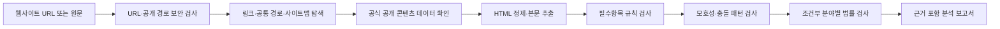

# 법령렌즈

대한민국 개인정보 보호 법령을 구조화한 규칙 엔진으로 개인정보처리방침의 누락·모호성·조건부 위험을 탐지하는 무료 컴플라이언스 지원 웹앱입니다.

[](https://github.com/GGBoo0/law-lens-privacy-auditor/actions/workflows/ci.yml)
[](./LICENSE)
[](./lib/legal-baseline.ts)

**[라이브 데모 사용하기](https://law-lens-privacy-kr.zzboof.chatgpt.site)** · **[피드백 남기기](https://github.com/GGBoo0/law-lens-privacy-auditor/issues/new/choose)**


## 프로젝트 소개

개인정보처리방침을 AI에 넣고 곧바로 위법 여부를 판단하게 하면 결과의 재현성과 설명 가능성이 떨어질 수 있습니다. 법령렌즈는 법률 결론을 대신 내리지 않고 다음 세 가지를 분리해 보여주는 것을 목표로 합니다.

- 법정 기재사항의 **누락 가능성**
- 포괄적 표현과 문단 충돌 같은 **그레이존**
- 실제 서비스 동작을 확인해야 하는 **현장 검증 필요사항**

모든 지적에는 원문 근거, 관련 법령·조문, 수정 권고와 자동 판정의 신뢰도를 함께 표시합니다.

## 주요 기능

- 회사 홈페이지 또는 처리방침 URL에서 링크·포함 문서·공통 경로·사이트맵 탐색
- 네이버·11번가의 공식 방침 경로와 토스·배달의민족의 공개 콘텐츠 데이터 지원
- HTML 본문 정제와 개인정보처리방침 텍스트 추출
- 개인정보 보호법 제30조·시행령 제31조 중심의 필수 공개항목 검사
- 제3자 제공·처리위탁·국외 이전의 필수 정보 완전성 검사
- 포괄적인 목적·보유기간·제공 범위 등 모호한 문장 패턴 탐지
- 서로 충돌하는 제3자 제공·위탁 문구 탐지
- 위치정보·개인신용정보·전자상거래·AI 서비스 신호의 조건부 검사
- 원문 근거, 법적 근거, 수정 권고, 현장 검증 필요 여부 제공
- 서비스 맥락(국외 이전·아동·전자상거래·AI) 보정
- 원문 근거 하이라이트와 문서 SHA-256 지문
- 사람 검토 상태·메모와 검토 내용 포함 JSON
- 인쇄 대화상자를 이용한 무료 PDF 보고서 저장
- 외부 AI API·유료 브라우저·유료 데이터 API·앱 데이터베이스 없이 요청 단위 분석

## 동작 구조



### 현재 분석 방식

현재 버전은 LLM 기반 AI가 아니라 TypeScript로 작성한 규칙·정규표현식·휴리스틱 엔진을 사용합니다.

1. 필수 제목과 관련 문장의 존재 여부를 검사합니다.
2. 제3자 제공·위탁·국외 이전 신호가 있으면 필수 세부항목을 추가 검사합니다.
3. “필요한 범위”, “회사가 판단하는 경우” 등 예측하기 어려운 표현을 찾습니다.
4. 서로 반대되는 문장을 탐지해 불일치 가능성을 표시합니다.
5. 높음·중간·낮음 발견 수를 가중해 처리방침 점검 점수를 계산합니다.

기본 점수식은 `100 - 높음×12 - 중간×6 - 낮음×2`입니다. 이 값은 법 위반 확률이나 기업의 준법 수준이 아니라 현재 규칙셋에서 발견된 보완 신호의 요약값입니다. 같은 문서는 같은 규칙셋에서 최대한 비슷한 결과가 나오므로 자동화된 1차 실무 체크에 적합합니다.

### URL 자동 탐색 QA

2026년 8월 5일 공개 홈페이지 기준으로 네이버·카카오·삼성·11번가·토스·배달의민족은 홈페이지 주소만으로 방침 본문을 추출했습니다. 쿠팡·G마켓은 사이트의 자동 수집 차단으로 실패해, 8개 중 6개(75%)가 성공했습니다. 이 수치는 고정 보장값이 아니라 외부 사이트 구조와 차단 정책에 따라 달라지는 스모크 테스트 결과입니다.

```bash
npm run test:live
```

실패 시에는 원인을 `site_blocked`, `policy_not_found` 등으로 구분하고 바로 원문 붙여넣기로 전환할 수 있습니다. 차단 우회를 시도하거나 유료 브라우저를 호출하지 않습니다.

## 법령 기준

규칙셋 `KR-PRIVACY-2026.08.05`는 2026년 8월 5일 국가법령정보센터와 개인정보보호위원회의 공식 원문을 기준으로 검증했습니다.

- [개인정보 보호법 제15조·제17조·제21조·제22조의2·제23조·제24조·제26조·제28조의8·제29조·제30조·제35조~제37조의2](https://law.go.kr/LSW/lsInfoP.do?lsiSeq=270351)
- [개인정보 보호법 시행령 제31조](https://www.law.go.kr/LSW/lsLawLinkInfo.do?chrClsCd=010202&lsJoLnkSeq=900079801)
- [개인정보 처리방침 작성지침 2026.04](https://www.pipc.go.kr/np/cop/bbs/selectBoardArticle.do?bbsId=BS217&mCode=&nttId=12018)
- [개인정보의 안전성 확보조치 기준 고시 제2026-9호](https://www.law.go.kr/LSW/admRulLsInfoP.do?admRulNm=%EA%B0%9C%EC%9D%B8%EC%A0%95%EB%B3%B4%EC%9D%98+%EC%95%88%EC%A0%84%EC%84%B1+%ED%99%95%EB%B3%B4%EC%A1%B0%EC%B9%98+%EA%B8%B0%EC%A4%80&docType=JO&joNo=001300000&languageType=KO&paras=1)
- 전자상거래법·위치정보법·신용정보법·인공지능기본법의 조건부 규칙

2026년 8월 20일 시행 예정인 개인정보 보호법 시행령 개정은 현재 처리방침 규칙 영향 없음으로 표시하고, 2026년 9월 11일 시행 예정인 개인정보 보호법 개정은 보고서에 예고만 표시하며 현재 분석 규칙에는 적용하지 않습니다. 법령 메타데이터는 [`lib/legal-baseline.ts`](./lib/legal-baseline.ts)에서 한 번에 관리합니다.

## 보안 설계

URL 입력을 받는 크롤링 서비스의 SSRF와 프롬프트 인젝션 위험을 주요 설계 대상으로 삼았습니다.

- `http`·`https`와 80·443 포트만 허용
- localhost, 클라우드 메타데이터, 내부 호스트 이름 차단
- 사설·예약·문서용 IPv4와 IPv6 대역 차단
- 공개 인터넷 전용 네트워크 격리와 모든 리다이렉트 URL 재검사
- 요청·응답 크기, 응답 시간, 리다이렉트 횟수 제한
- 응답 본문을 스트리밍으로 읽으며 최대 크기 초과 시 중단
- 동일 출처·JSON 요청 검사와 IP별 요청 속도 제한
- 원문·URL을 저장하지 않는 D1 전역 요청 제한(복원 불가능한 IP 해시와 1분 창만 저장)
- nonce 기반 CSP, 클릭재킹·MIME 스니핑 방지 헤더
- 스크립트·스타일·프레임을 제거하고 본문을 비신뢰 데이터로만 처리

자세한 URL 검증 코드는 [`lib/network-security.ts`](./lib/network-security.ts), 분석 API는 [`app/api/analyze/route.ts`](./app/api/analyze/route.ts)에서 확인할 수 있습니다.

## 기술 스택

| 영역 | 기술 |
| --- | --- |
| 프론트엔드 | Next.js 16, React 19, TypeScript |
| 빌드·런타임 | Vinext, Vite, Cloudflare Workers |
| 분석 | TypeScript 규칙 엔진, 정규표현식, 휴리스틱 |
| 테스트 | Node.js Test Runner, 서버 렌더링·API 통합 테스트 |
| 배포 | OpenAI Sites |

## 로컬 실행

요구 환경은 Node.js `22.13.0` 이상입니다.

```bash
npm install
npm run dev
```

브라우저에서 `http://localhost:3000`을 열어 확인합니다.

### 검증

```bash
npm test
npm run lint
```

`npm test`는 프로덕션 빌드 후 다음 동작을 검증합니다.

- 한국어 서비스 화면 서버 렌더링
- 외부 서비스 없는 원문 분석
- 모호한 문장과 상충 문구 탐지
- 교차 사이트·비 JSON·사설 네트워크 요청 차단
- 전자상거래법 시행령 근거 연결
- 반복 요청 속도 제한

`npm run test:live`는 넥슨·네이버·11번가·토스·배달의민족의 현재 공개 페이지를 대상으로 URL 자동 탐색을 검증합니다. 외부 사이트 상태에 영향을 받으므로 기본 CI와 분리했습니다.

## 프로젝트 구조

```text
app/
  api/analyze/route.ts     URL 수집·본문 추출·API 방어
  page.tsx                 입력 화면과 분석 대시보드
lib/
  legal-baseline.ts        법령 검증일·버전·공식 출처
  network-security.ts      URL·IP·스트림 보안 검사
  privacy-analyzer.ts      규칙 엔진과 보고서 생성
tests/
  rendered-html.test.mjs   렌더링·분석·보안 통합 테스트
  live-url.test.mjs        주요 공개 사이트 URL 스모크 테스트
proxy.ts                   전역 보안 헤더와 CSP nonce
```

## 현재 한계

- 법령 개정사항이 자동으로 반영되지 않으므로 규칙셋 검증일을 확인해야 합니다.
- PDF·HWP·이미지 안의 표와 로그인 뒤 화면은 자동 분석하지 못합니다.
- 공식 공개 콘텐츠 경로를 알 수 없는 자바스크립트 전용 방침과 자동 수집 차단 사이트는 원문 붙여넣기가 필요합니다.
- 실제 회원가입 항목, 쿠키 전송, SDK, 국외 전송과 파기 실행 여부는 확인하지 않습니다.
- 규칙 기반 분석이므로 새로운 표현이나 복잡한 문맥에서 오탐·누락이 발생할 수 있습니다.
- 패턴 일치 수준은 통계적으로 보정된 확률이 아니며, 규칙 회귀 코퍼스를 계속 확장해야 합니다.
- 자동 결과는 변호사의 법률의견이나 규제기관의 판단을 대체하지 않습니다.

## 로드맵

- [x] HTML 표 셀 경계 보존과 열 구분 추출
- [x] 검토자의 해당 없음·수정 완료·검토 의견 기능
- [x] 분석 원문 SHA-256 지문과 규칙셋 버전 기록
- [ ] 표 제목과 필수 열의 의미 단위 검사
- [x] 핵심 모호성 규칙의 골든 코퍼스 회귀 테스트
- [x] 공통 경로·사이트맵·공식 공개 데이터 기반 URL 탐색
- [ ] 규칙별 정밀도·재현율을 측정하는 익명 평가 코퍼스 확장
- [ ] 이전 처리방침과 변경사항 비교
- [ ] PDF 처리방침 텍스트 추출
- [ ] 회원가입·쿠키 동작과 처리방침의 불일치 검사
- [ ] 규칙 결과와 분리된 선택형 LLM 심층 분석

## 피드백과 기여

라이브 데모를 사용한 뒤 발견한 오탐·누락, 사용성 의견과 개선 아이디어를 [GitHub Issues](https://github.com/GGBoo0/law-lens-privacy-auditor/issues/new/choose)에 남겨주세요.

보안 취약점에 악용 가능한 세부정보나 실제 개인정보는 공개 이슈에 작성하지 마세요.

## 라이선스

이 프로젝트는 [MIT License](./LICENSE)로 공개합니다.

> 법령렌즈는 법률 리스크의 조기 발견을 위한 자동화 도구이며 변호사의 법률의견을 대체하지 않습니다.
